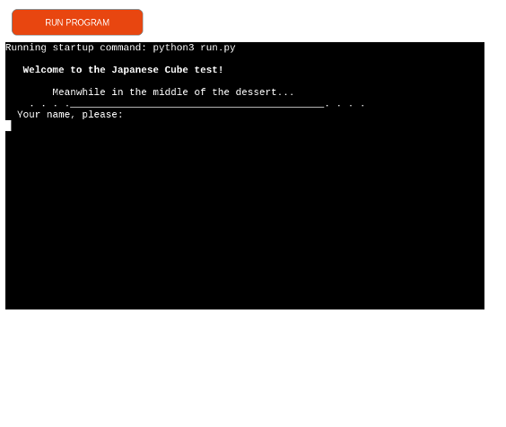
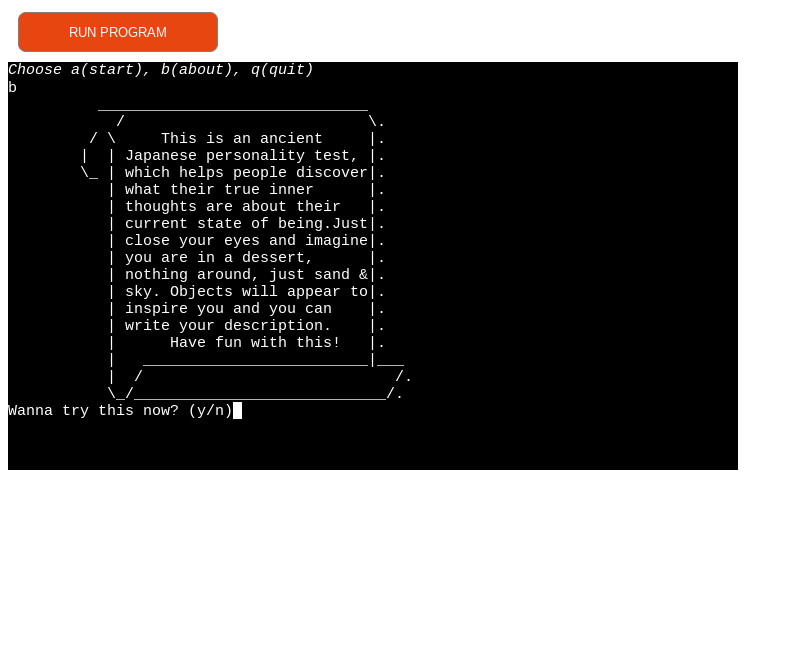
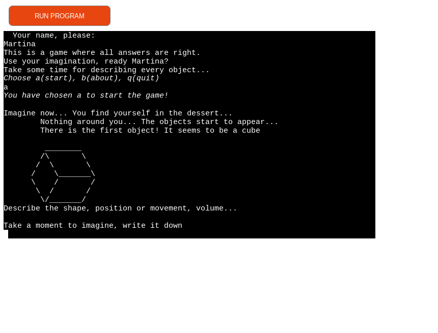
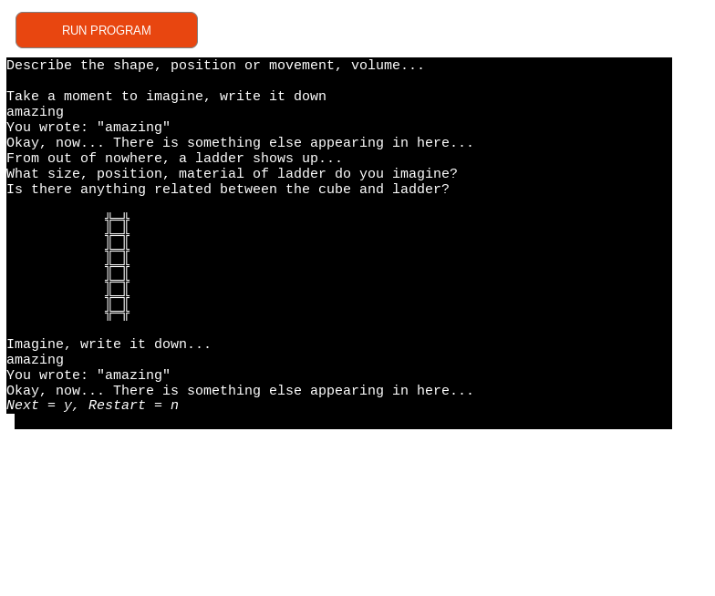
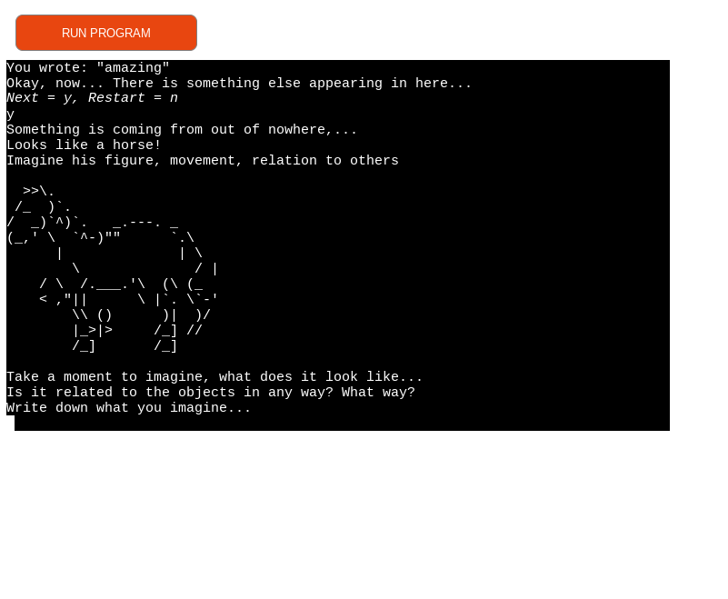
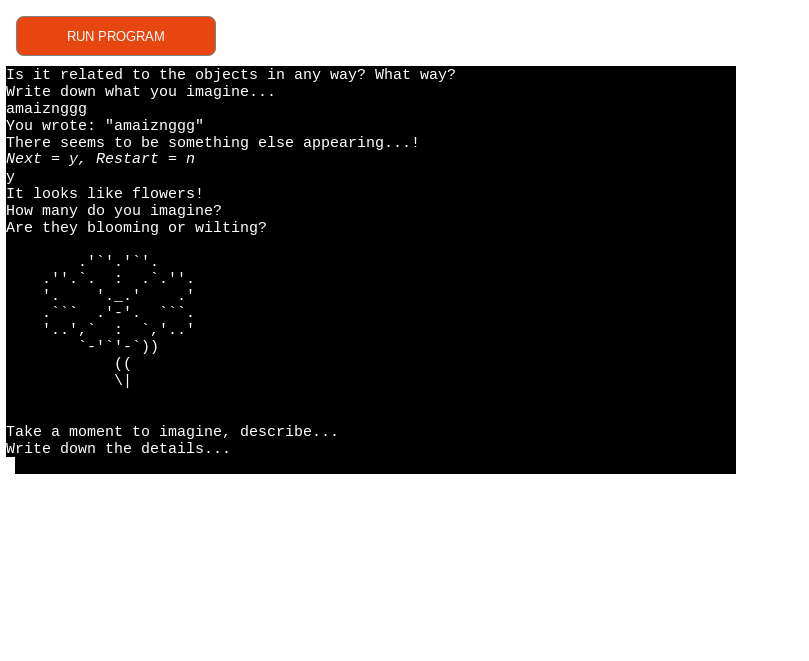
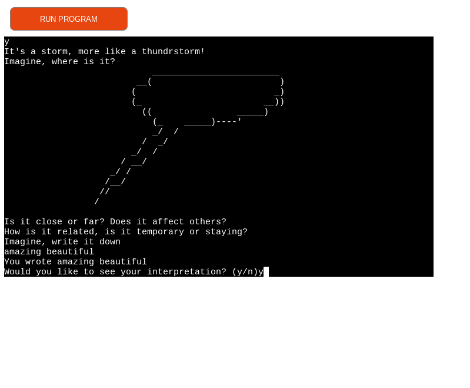
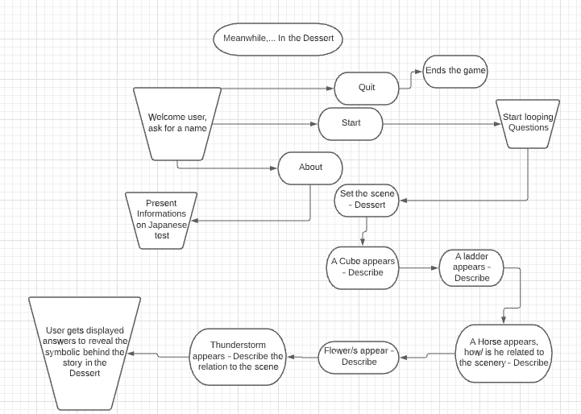

# Japanese test - Dessert, Cube, Ladder, Horse, Flowers, Storm

## Description

This application is is a personality test deriving from japanese culture, and this [link](https://steemit.com/psychology/@breezin/cube-test-japenese-personality-test) provides all relevant information about how this game works. It can also help users to notice how do they see themselves and sparkle some imagination.

### Welcome Page

### About

Entered test - First object - cube

Second object - Ladder

Third object - Horse

Fourth object - Flowers

Fifth object - Thunderstorm

# Content 

## User Stories 

* I want the User to understand and navigate easy through the test
* I want the User to be able to start/restart/quit the app and get information about the game 
* I want the User to be able to write the description of objects
* I want User to have the responses displayed
* I want User to be notified when the characters that he inputs are not supported with an apropriate message
* I want to possibly use one of Python libraries to create a visual appearance of the results

## Site Owner Goals

* To offer user a display of answers to the questions
* To be able to guide users and collect their answers, and a name
* To be able to display a personality test in a fun way to users

## Instructions

Describe step by step process

# Flowchart

# Features

* Existing features
* Future features

# Libraries Used

* Python Prompt Toolkit library

# Deployment

## Github

Commiting often, on every change - explain processes

## Heroku
Deploying right after commiting on Git - explain processes

# Credits 

The italics code were found in [this link](https://stackoverflow.com/questions/13559276/can-i-write-italics-to-the-python-shell)

The code for prompt asking user for a name is found [here](https://python-prompt-toolkit.readthedocs.io/en/stable/pages/asking_for_input.html)

The code for clearing the screen before moving on to next object is [here]( https://www.geeksforgeeks.org/clear-screen-python/)

# Acknowledgements

Code Institute mentor, Tim Nelson is huge help and guidance, helping me and directing my ideas toward real goal to be accomplished through creating this app. I was unsure on how to start and I had perfect guidance.
My close friends who tested the app a few times, shared insights and concerns that help me make this better for the UX.

Welcome Martina Grganic,

This is the Code Institute student template for deploying your third portfolio project, the Python command-line project. The last update to this file was: **August 17, 2021**

## Reminders

* Your code must be placed in the `run.py` file
* Your dependencies must be placed in the `requirements.txt` file
* Do not edit any of the other files or your code may not deploy properly

## Creating the Heroku app

When you create the app, you will need to add two buildpacks from the _Settings_ tab. The ordering is as follows:

1. `heroku/python`
2. `heroku/nodejs`

You must then create a _Config Var_ called `PORT`. Set this to `8000`

If you have credentials, such as in the Love Sandwiches project, you must create another _Config Var_ called `CREDS` and paste the JSON into the value field.

Connect your GitHub repository and deploy as normal.

## Constraints

The deployment terminal is set to 80 columns by 24 rows. That means that each line of text needs to be 80 characters or less otherwise it will be wrapped onto a second line. --- what does this mean??? ask tim

-----
Happy coding!