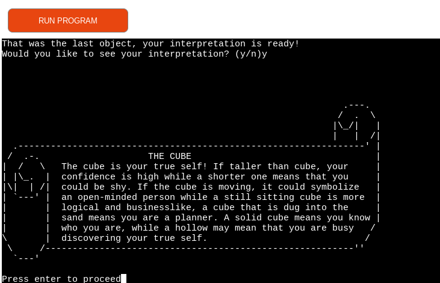
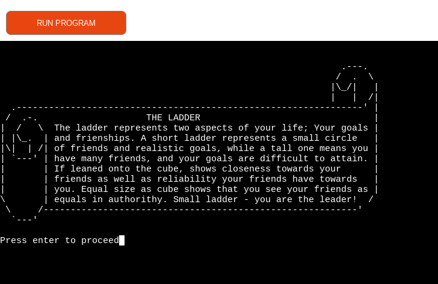
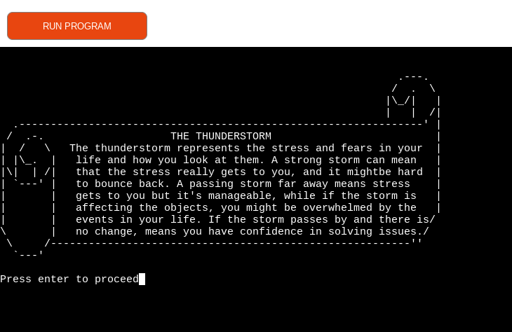

# Japanese test - Dessert, Cube, Ladder, Horse, Flowers, Storm

## Description

This Python application is a personality test deriving from Japanese culture, and this [link](https://steemit.com/psychology/@breezin/cube-test-japenese-personality-test) inspired this application. Terminal runs on Heroku, a container-based cloud Platform as a Service (PaaS).

## Instructions

As user is describing and probably using spaces, the applicaton allows for commas/dots/other symbols as inputs to make it more personalized for users. Only at description inputs.
Steps are as follows:

- Welcome is displayed, user is asked for a name to start.
The welcome page is presenting the test, without too many details, asking for the name. It is part of the mystery, so curiosity is sparkled. After user enters the name, users are greeted back and encouraged to be creative and take time to describe objects. As the name contains a word 'test', I wanted to assure the users mentioning that all answers are right, so they feel free to describe in greater details.
- Choosing a to start, b to read about, and q to quit
If chosen q to quit, users exit the application with appropriate 'Goodbye' message,
if chosen to see informations about the test, users can read a bit more, and after reading about the application, users are asked to try the test or not, and if not, the users exit the test with appropriate message displayed. If chosen to try it, user starts with first object, the cube.
- Describing the objects
There are 5 different objects, starting from the cube, to be described, then a horse, then flowers and lastly, a thunderstorm. Users are asked to describe in details what do they imagine, and what kind of setting they imagine, position and the relation between objects if there is any.
- After answering and describing every object, user is offered to read about the interpretation of every object. If not wanting to read at that moment, user can choose n to exit or start the test over entering y.

## User Stories 

* I want the User to easily understand and navigate through the test
* I want the User to be able to start/quit the app and get information about the game 
* I want the User to be able to write the description of objects
* I want User to have the responses displayed after the user input
* I want User to be notified when the empty space that he inputs is not supported and prompted with an appropriate message
* I want the User to be given another chance to put information for description if nothing entered
* I want the User to be able to stop the test from asking, and exit with a greeting
* I want the User to have fun, get personal and have a positive experience

## Site Owner Goals

* To entertain users by inspiring them to know themselves better
* To offer user a display of answers to the questions
* To be able to guide users and collect their answers and a name
* To be able to display a personality test in a fun way to users
* To inspire people to love themselves more by paying more attention to thoughts

## Flowchart

Displaying the flow of this application

## Features

### Welcome Page

### About

Choosing option 'b' it displays some information about this test, to sparkle imagination

Entered test - First object - user is asked to describe

Second object - Ladder - user is asked to describe

Third object - Horse - user is asked to describe

Fourth object - Flowers - user is asked to describe

Fifth object - Thunderstorm - user is asked to describe

After writing out descriptions, user can see the interpretations of their objects one by one, navigating by pressing 'Enter'
Interpretation - Cube

Interpretation - Horse

Interpretation - Ladder

Interpretation - Flowers

Interpretation - Thunderstorm

### Future features

I would like this app to be able to generate the whole document with answers and interpretations together for users so they could print and keep a hard copy if they like

## Application Model

Pure Python is used to create this application. It is made for a user to interact by writing down user name, descriptions and navigate using keyboard, mostly y/n options. 
The Flow of functions is relevant as the goal is for the user to control to start playing this test or exit the test.
ASCII visual display is used in a print() with 'r' before triple quotes, as well as conditional, nested conditionals, a for loop, checking input by calling lower() for to be accepted any letter.
At the name input, checked with a function isalpha()

## Testing

I have manually tested this application by doing the following:
- Passed the code through PEP8 linter and confirmed there is no issues
- Given empty space as input, when characters are expected
- Given wrong letter when specific letter is expected
- Tested in my local terminal and the Code Institute Heroku terminal 

The link to images and more details on all testing is [here](https://github.com/totalnoMartina/cube-discovery/blob/main/TESTING.md)

## Technologies 
links and explain

* Git
* GitHub -  used for version control
* Gitpod - Cloud-based IDE and the steps for deployment
* Python

### Python Packages 

* Prompt-toolkit if used explain every and links connect
* Tabulate

## Validator - PEP8

Validating through PEP8 online website, and no issues presented

## Deployment

### GitHub

- In the [GitHub repository](https://github.com/totalnoMartina/cube-discovery),navigate to the Settings tab.
- From the Source section drop-down menu, select the `Main` Branch (alt: `Master`).
- Once the `Main` branch has been selected, the page will be automatically refreshed with a detailed ribbon display to indicate the successful deployment.

### Local Deployment

In order to make a local copy of this project, you can clone it using the following link in your IDE terminal of your choice:

- `git clone https://github.com/totalnoMartina/cube-discovery.git`

Alternatively, if using Gitpod, you can click below to create your own workspace using this repository.

### Heroku

Explain step by step, creating a heroku account, create an new app, select region, go to 'deploy' tab, sleect github as deployment method, locate your repository on Github, select 'connect reposit' , enable automatic deployments, thwn go settings tab, and packages here below:
When deploying on Heroku, two buildpacks are installed from the _Settings_ tab.

1. `heroku/python`
2. `heroku/nodejs`

A _Config Var_ was added and named `PORT`, and set to `8000` before clicking deploy branch.
go back to deploy tab, click deploy branch, it will take coulpe minutes to install requirements, once it is finished, you can view live deployed site and list the link to your site. screenshots of the steps maybe - optional

## Credits 

The italics code were found in [this link](https://stackoverflow.com/questions/13559276/can-i-write-italics-to-the-python-shell)

The code for prompt asking user for a name is found [here](https://python-prompt-toolkit.readthedocs.io/en/stable/pages/asking_for_input.html)

The code for clearing the screen before moving on to next object is [here]( https://www.geeksforgeeks.org/clear-screen-python/)

The help to find a list of functions is found on this [link](https://www.quora.com/How-can-you-make-a-list-of-functions-in-Python)

The frame for interpretations are found [here](https://textart4u.blogspot.com/2012/03/frame-borders-text-art-ascii-art.html)

# Acknowledgements

Code Institute mentor, Tim Nelson is huge help and guidance, helping me and directing my ideas toward real goal to be accomplished through creating this app. I was unsure on how to start and I had perfect guidance.
My close friends who tested the app a few times, shared insights and concerns that help me make this better for the UX.
