# Testing

Testing user input for many different characters or empty space
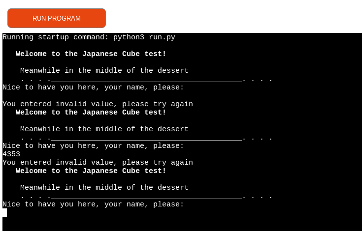

Testing entering empty space when starting with the first object
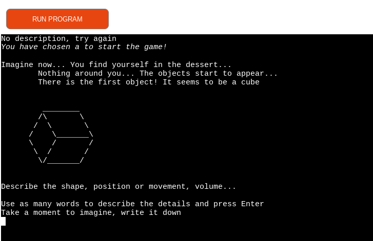

Testing second object for empty input by user
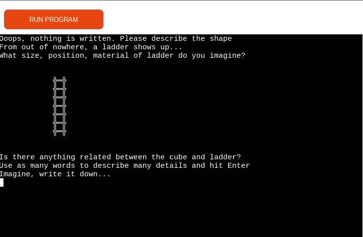

Testing third object for empty space input by user
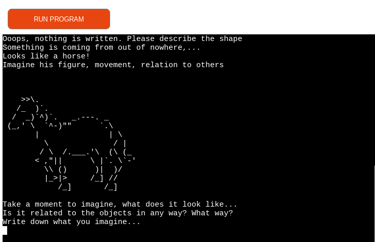

Testing fourth object for empty space input by user
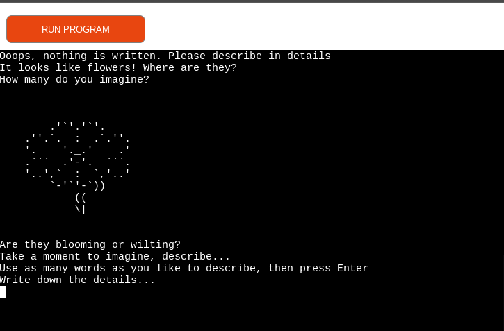

Testing user for the input on choosing to see interpretation

Testing user input while starting the test
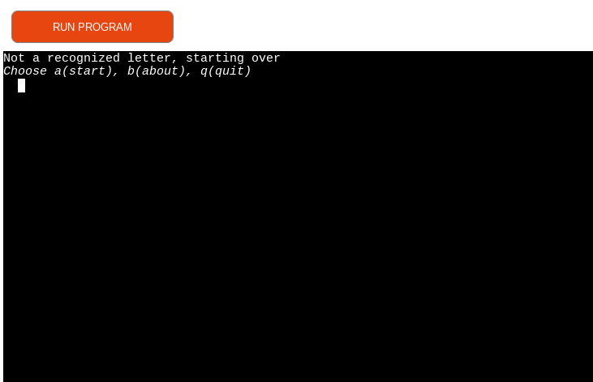

Start test, choose quit if user wanted and get appropriate message
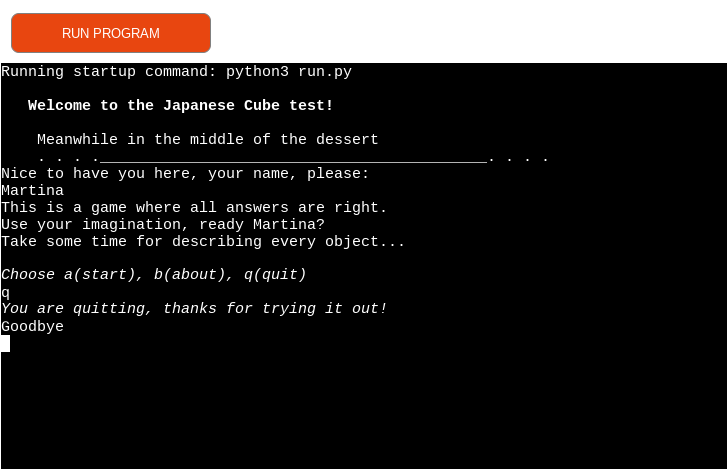

Validating input for characters not accepted and present appropriate message
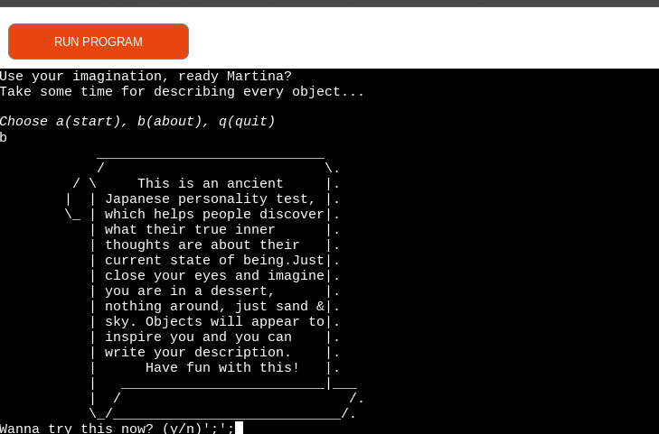

Testing at the object thunderstorm for empty space, user gets appropriate message
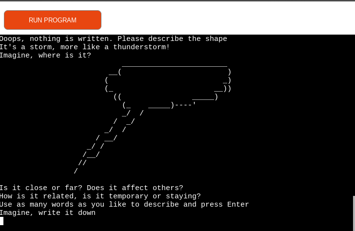

Testing validation for putting more words and characters which should be accepted from user and displayed
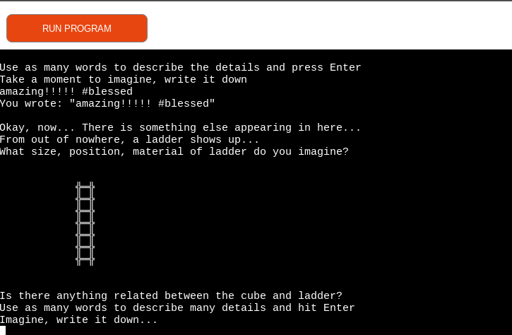

User is able to start again at the end of this test
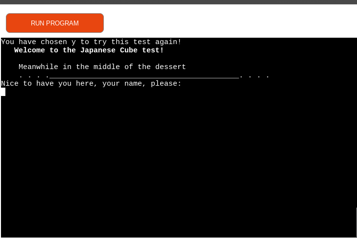

## Bugs

Double function cube showed up as a bug during creating this test, dicovered after testing that it just stayed uncommented like a few other functions, and got resolved after testing.
It took me some time to realize that isalpha() as a function does not suit this concept so it took some time to just accept simple solution instead, which I was satisfied with. I mostly focused on empty space being entered and validated with appropriate message for the user at all occasions.

### Validation testing Notes

Please Note!
During testing the function cube() for validation of the user input being symbols/characters as '#;08=-' or space character, a method .isalpha() was tested many times, which is also spacebar-sensitive, and will not take user input if entered space in between. The method is taken out of the function for the reason of user possibly wanting to describe in long sentences with a comma or space and possibly exclamation marks or similar. Therefore, the function prints out exact input of user with the symbols included, if any. 
By putting this method I might have had limited user to describe everything in one go and made it more complicated. So this was my reason to not use validation for isalpha() and accept symbols as user input.
Another option considered was using creating a list from user input, adding inputs into a list, separating by a comma or space (again, something that complicates function further), and then later using for loop to place them back as user wrote them or a common method in Python called tostring(). In my perspective, this validation is only relevant if user slips a finger without writing anything in, so we bring user back to the beginning to write the description again, with apropriate prompt. And if user wants to put commas/spaces, I wanted that to be allowed.

Some infinite loops are caused and that was handled with exiting function.

For iterating from one object to another, I had an idea to use separate function called next_or_restart() which was used before the functions were ready to connect to each other. As the app evolved, the function is no longer needed and therefore, deleted.
At the bottom of this [image](https://github.com/totalnoMartina/cube-discovery/blob/main/documentation/readme-images/ladder.png) you can see user being asked to go 'Next or Restart'.
The testing of app in the start was by creating a function called all_funcs() that will have smaller functions for me to test and manipulate.

Original validation was discovered through these bugs.

## Test User Stories

* I want the User to understand and navigate easy through the test
* I want the User to be able to start/restart/quit the app and get information about the game 
* I want the User to be able to write the description of objects
* I want User to have the responses displayed
* I want User to be notified when the characters that he inputs are not supported with an apropriate message
* I want the User to be notified of empty input and given another chance to put information
* I want to possibly use one of Python libraries to create a visual appearance of the results

## Features
### Welcome Page

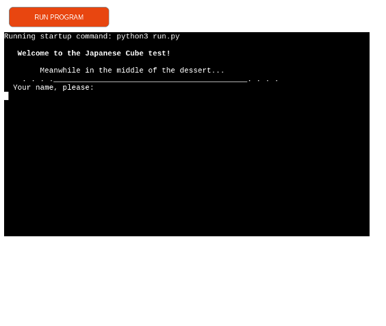

### About

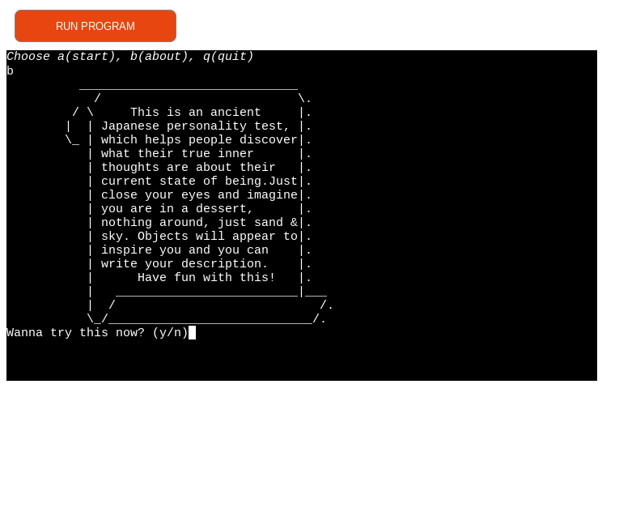

Entered test - First object - Cube

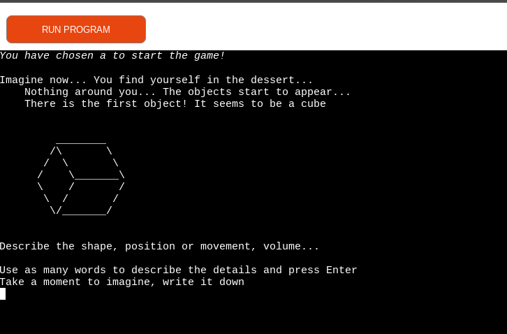

Second object - Ladder

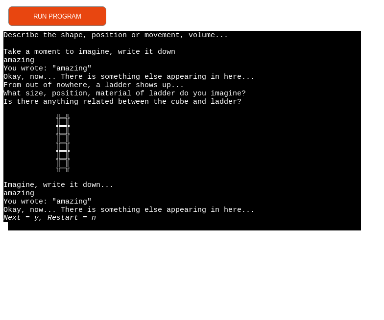

Third object - Horse

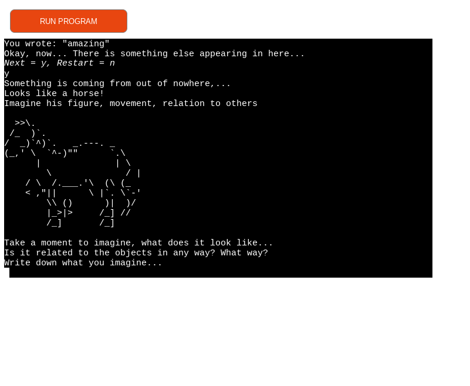

Fourth object - Flowers

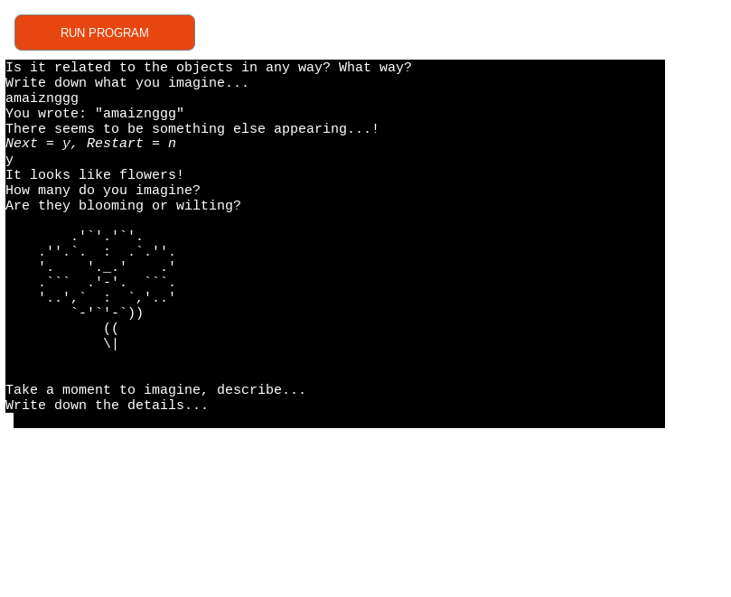

Fifth object - Thunderstorm

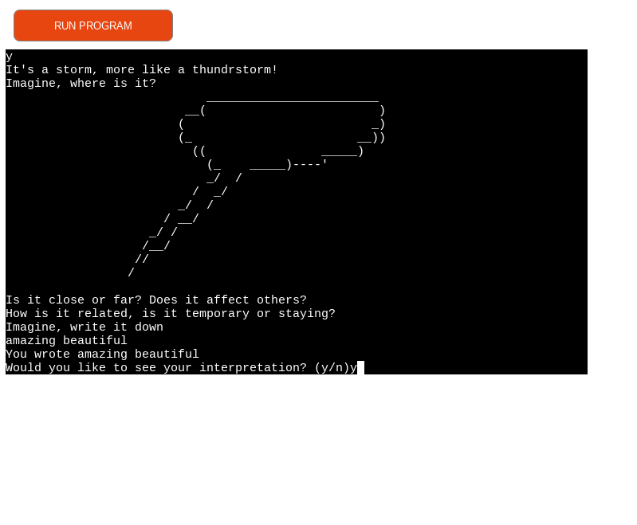

Interpretation - Cube
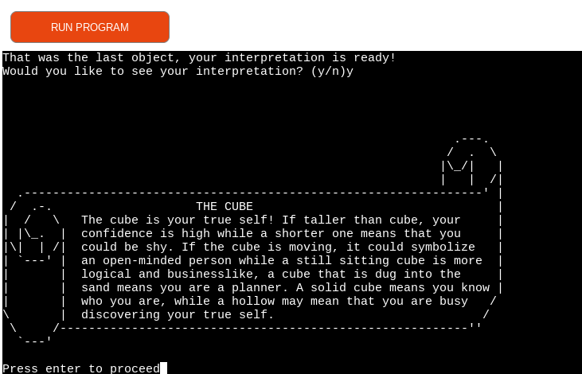

Interpretation - Horse
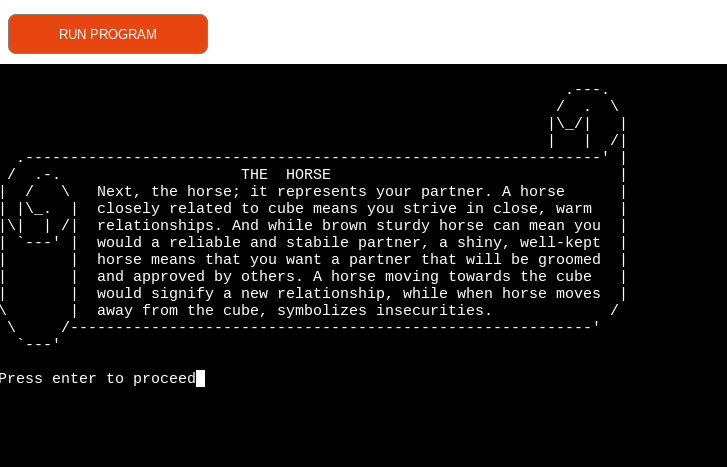

Interpretation - Ladder
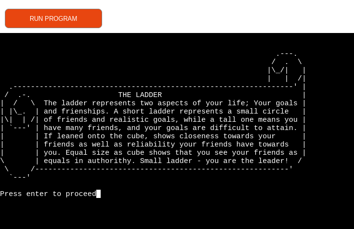

Interpretation - Flowers
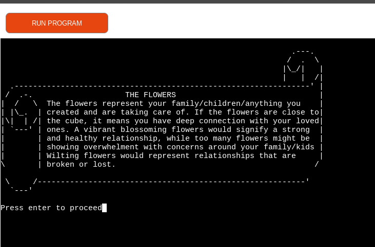

Interpretation - Thunderstorm
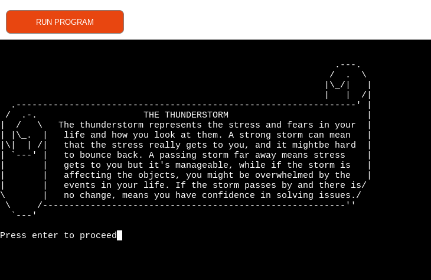

## Further Testing

