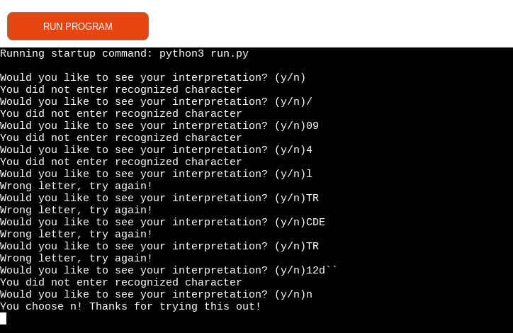
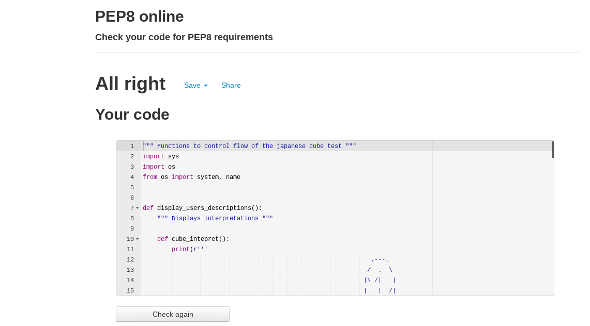
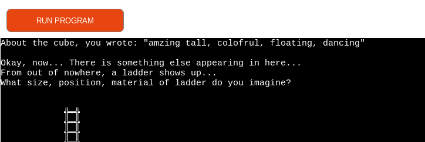
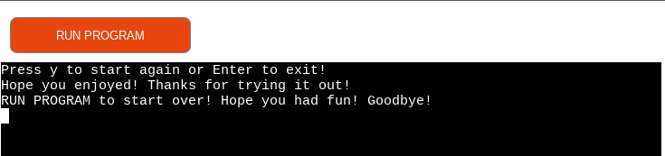

# Testing

Testing user input for many different characters or empty space

Testing user input while starting the test

Testing entering empty space when starting with the first object

Testing second object for empty input by user

Testing third object for empty space input by user

Testing fourth object for empty space input by user

Testing the fifth object for empty input by user

Testing user for the input on choosing to see interpretation

Checking Enter to exit the application at the end

Start test, choose quit if user wanted and get appropriate message

Validating input for characters not accepted and present appropriate message

Testing validation for putting more words and characters which should be accepted from user and displayed

User is able to start again at the end of this test

## Bugs

### Solved bugs

Double function cube showed up as a bug during creating this test, and dicovered after testing that it just stayed uncommented like a few other functions, and got resolved after testing.

Trying using isalpha() as a function does not suit in taking input without spaces, and this concept, so it took some time to accept and apply another simple solution instead. I mostly focused on empty space being entered and validated with appropriate message for the user at all occasions.

At the welcome, the input that takes the name of the user could be more detailed in explanation, and stating that user should write in one word. I wanted only normal letters and one word to be accepted and obvious to user.

### Unresolved bugs

This application is created using Chromebook based on Chromium (Linux) and sometimes it would freeze, not sure is it because of machine, or the app, or the fact that the changes are recorded by Heroku and that could make it freeze. Refreshing resolves this issue.

## Validator - PEP8

Validating through PEP8 online website, and no issues were presented

### Validation testing Notes

Please Note - accepting all characters in user_answer_inputs ('user_anwer_first/second/third/fourth/fifth') is planned for this app.
Details below:
During testing the function cube() for validation of the user input being symbols/characters as '#;08=-' or space character, a method .isalpha() was tested many times, which is also spacebar-sensitive, and will not take user input if entered space in between. The method is taken out of the function because of user possibly wanting to describe in long sentences with a comma or space and possibly exclamation marks or similar. Therefore, the function prints out exact input of user with the symbols included, if any. 
By putting this method I might have had limited user to describe everything in one go and made it more complicated. So this was my reason to not use validation for isalpha() and accept symbols as user input and only respond to user once the empty space is entered.

Another option considered was creating a list from user input, splitting by space, adding inputs into a list, separating by a comma or space (again, something that complicates function further), and then later using for loop to place them back as user wrote them or a common method in Python called tostring(). In my perspective, this validation is only relevant if user slips a finger without writing anything in, so we bring user back to the beginning to write the description again, with apropriate prompt message. And if user wants to put commas/spaces, I wanted that to be allowed.

While infinite loops are caused, that was handled with an exiting function, and some are changed to conditional as it did not suit - like for welcome. I did not want the application to keep being in a loop, so I made an option to stop the function for user. I find it could be annoying if it keeps insisting on users to try again. There is 'Run Program' to direct user after playing if he wants to start again so it is on user to decide.

For iterating from one object to another, I had an idea to use separate function called next_or_restart() which was used before the functions were ready to connect to each other. As the app evolved, the function is no longer needed and therefore, deleted.
At the bottom of this [image](https://github.com/totalnoMartina/cube-discovery/blob/main/documentation/readme-images/ladder.png) you can see user being asked to go 'Next or Restart'.

The testing of app in the start was done by creating a function called all_funcs() that had smaller functions for me to test and manipulate. It was deleted after the app is ready, as it was no longer needed.

## User Stories 

* I want the User to be welcomed and asked for a name

* I want the User to be able to start/quit the app and get information about the game

* I want the User to be able to write the description of objects

* I want User to have the responses displayed after the user input

* I want User to be notified when the empty space that he inputs is not supported and prompted with an appropriate message

* I want the User to be given another chance to put information for description if nothing was entered

* I want the User to be able to stop the test from asking, and exit with a greeting

* I want the User to have fun, get personal and have a positive experience

## Further Testing

One idea was to keep user input as global variables at the start, than use later in a function where interpretation is displayed, so they come up together. But the screen of terminal is limited, so this is why I was happy to find a function which clears the screen. That noted, cleared screen would free up space for the visual space and remove the inputs as nothing existed, so therefore I did not implement this idea in this application. 
